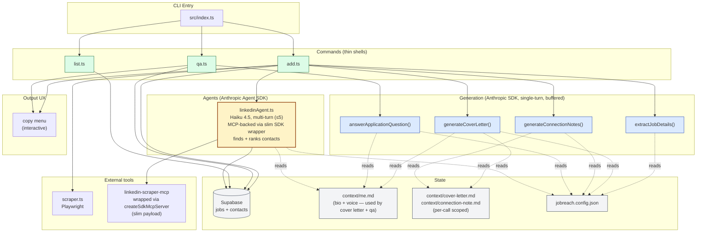

# jobreach — Restructure Plan

A focused restructure: **strip the noise, use the right SDK in each place, build one real agent for LinkedIn discovery where decisions actually happen.**

The current codebase is ~2000 LOC of mostly-procedural pipeline that's wrapped in the Agent SDK even when no agent behavior is happening (single-turn text gen runs through a Claude Code subprocess for ~3s per call). Path B trims it, makes text generation actually fast via the raw Anthropic SDK, and **rebuilds LinkedIn discovery as a genuinely agentic loop over MCP** — where the model decides what to call, how to broaden, and how to rank. This is both useful as a working feature AND the right place in the project to actually use the Agent SDK end-to-end.

We're choosing the agentic path here knowing it costs more per `add` than a procedural pipeline would. The tradeoff is bought down with concrete mitigations (Haiku, capped turns, slim MCP payloads) so the cost stays manageable.

---

## Goals

1. **Strip features you no longer want** — auto-connect, token logging, helper scripts
2. **Make text generation fast** — direct Anthropic SDK calls (~200ms cold) instead of Agent SDK subprocess spawns (~3s)
3. **Build one real agent** for LinkedIn discovery — Agent SDK + MCP, multi-turn, tool-using
4. **Keep the agent cheap** — Haiku 4.5 instead of Sonnet, capped turns, slim MCP payload wrapper
5. **Add an interactive copy menu** so you can grab outputs without fighting the terminal
6. **Simplify the schema** — drop the now-vestigial `messages` table

---

## Architecture overview

The mermaid diagram below renders natively in GitHub, VS Code's markdown preview, Obsidian, and most modern markdown viewers. ASCII fallback follows.



### ASCII fallback

```
┌─────────────────────────────────────────────────────────────────┐
│                       src/index.ts (CLI)                        │
└────────────────┬──────────────────┬─────────────────────────────┘
                 │                  │
       ┌─────────▼────────┐ ┌───────▼─────┐ ┌────────────┐
       │  commands/add.ts │ │ commands/qa │ │ list.ts    │
       └────┬──────┬──────┘ └────┬────────┘ └─────┬──────┘
            │      │             │                │
            │      ▼             │                │
            │ ┌──────────────────────────────┐    │
            │ │  agents/linkedinAgent.ts     │    │
            │ │  Agent SDK + Haiku 4.5       │    │
            │ │  ≤5 turns, MCP-backed        │    │
            │ │  • calls slim MCP wrapper    │    │
            │ │  • interprets messy titles   │    │
            │ │  • ranks top-3 with reasoning│    │
            │ └────────┬─────────────────────┘    │
            │          │                          │
            │          ▼                          │
            │   createSdkMcpServer wrapper        │
            │   (slim payload: name+title+URL)    │
            │          │                          │
            │          ▼                          │
            │   linkedin-scraper-mcp              │
            │   (uv tool run ...)                 │
            │                                     │
            ▼                                     │
   ┌──────────────────────────────────┐           │
   │  lib/generator.ts                │           │
   │  (Anthropic SDK, single-turn,    │           │
   │   buffered, per-call scoped)     │           │
   │   • extractJobDetails            │           │
   │   • generateCoverLetter          │           │
   │   • generateConnectionNotes      │           │
   │   • answerApplicationQuestion ◄──┼───────────┘
   └──────────────────────────────────┘
                  │                                ┌────────────────┐
                  ▼                                │ context/       │
   ┌──────────────────────────────────┐ ◄──────────┤  me.md         │
   │  Supabase (jobs, contacts)       │            │  cover-letter  │
   └──────────────────────────────────┘            │  connection... │
                                                   │ profile.json   │
                                                   │ (per-call scope)│
                                                   └────────────────┘
                  │
                  ▼
   ┌──────────────────────────────────┐
   │  lib/copyMenu.ts                 │
   │  (clipboardy, interactive)       │
   └──────────────────────────────────┘
```

---

## The SDK split — why each piece uses what it does

| Layer | Library | Why |
|---|---|---|
| LinkedIn discovery | `@anthropic-ai/claude-agent-sdk` | Multi-turn agent loop over MCP tools running on Haiku 4.5. This is where agentic behavior earns its spawn cost — Claude decides which tool to call, when to broaden, and how to rank. |
| MCP transport (inside the agent) | Agent SDK's `mcpServers` + `createSdkMcpServer` wrapper | The Agent SDK natively attaches MCP servers. We wrap the upstream `linkedin-scraper-mcp` with a custom SDK MCP server (`createSdkMcpServer`) that calls the upstream tool then trims the payload down to `{name, title, linkedinUrl}` per employee before returning to the agent. This is the biggest cost mitigation. |
| Generation (letter, notes, qa, extract) | `@anthropic-ai/sdk` (raw API) | Single-turn, no tools, no decisions. String-in, string-out. ~200ms cold start vs Agent SDK's 2–5s. No streaming — outputs are buffered, status ticks shown per step ("cover letter done ✓"), final results printed cleanly at the end. |
| Per-call context scoping | hand-assembled system prompts | Each LLM call reads ONLY the context it needs. Smaller prompts → faster TTFT, no context bleed between different output formats. No caching layer (single-pass, one-shot usage doesn't benefit). |

### Keeping the agent cheap (the deliberate mitigations)

The Agent SDK is the most expensive part of this restructure if used naively. We use it knowingly, with these four guardrails:

1. **Haiku 4.5, not Sonnet.** Tool use and short-horizon reasoning are genuinely Haiku's strong suit. ~3× cheaper than Sonnet ($1/M input, $5/M output vs $3/$15). For ranking employees against named heuristics, Haiku is more than enough.
2. **`maxTurns: 5`.** Forces the agent to commit. No infinite "let me try one more search" loops.
3. **Slim MCP payload wrapper.** Upstream `get_company_employees` returns full page text + references with extra fields. A custom SDK MCP server in `linkedinAgent.ts` proxies through, calling the upstream tool then returning a stripped `{name, title, linkedinUrl}` array. Cuts the agent's input tokens dramatically.
4. **Tight system prompt with pre-loaded heuristics.** Give the agent the bins explicitly (recruiter regex, uni-recruiter regex, engineer regex) so it doesn't spend turns figuring out title taxonomy from scratch. The agent's job is judgment, not pattern-matching.

With these in place, realistic per-`add` agent cost lands around **$0.02–0.04** instead of the $0.10–0.25 naive estimate.

### "How does Claude Code respond so fast?" — recap

- **Persistent process.** `claude` is one long-running Node process. Each turn reuses the already-loaded runtime, cached MCPs, parsed settings. The Agent SDK's `query()` is slow precisely because it boots a fresh `claude` per call.
- **Streaming API.** Tokens arrive incrementally; UX hides latency.
- **Aggressive prompt caching.** CLAUDE.md, conversation history, tool defs — all cached for 5 minutes. Follow-up turns pay only for the new content.

This is why **the Anthropic SDK is the right tool for our generation calls** — we don't need a persistent process (single-turn), we don't need MCPs (no tools), no decisions to make. We deliberately skip streaming and caching for these calls: streaming would conflict with parallel work in `add`, and caching wins are negligible for one-shot usage. The Agent SDK only earns its spawn cost on LinkedIn discovery, where multi-turn tool use is the actual point.

---

## Files: delete, create, modify

### Delete (~870 LOC removed)

- [ ] `src/commands/connect.ts` (145 LOC) — auto-connect command
- [ ] `src/lib/linkedin.ts` (92 LOC) — `sendConnections()` helper for auto-connect
- [ ] `src/lib/linkedinMcp.ts` (318 LOC) — bespoke MCP wrapper; replaced by the slim `createSdkMcpServer` wrapper inside `linkedinAgent.ts`
- [ ] `src/lib/agent.ts` (306 LOC) — bespoke procedural pipeline; replaced by `linkedinAgent.ts`
- [ ] `src/lib/tokenLog.ts` (61 LOC) — unreliable; remove every `recordTokens()` callsite too
- [ ] `scripts/measure-tokens.ts` (71 LOC) — depends on tokenLog
- [ ] `scripts/probe-mcp.ts` (31 LOC) — dev scratch
- [ ] `NOTES.md` — scratch
- [ ] `--connect` flag handling in `add.ts` (~30 LOC inline)
- [ ] All `recordTokens()` / `resetTokenLog()` / `tokenSummary()` callsites

### Create

- [ ] `src/agents/linkedinAgent.ts` — the one real agent. Defines a slim `createSdkMcpServer` wrapper around `linkedin-scraper-mcp`, runs Haiku 4.5 with `maxTurns: 5`, returns ranked contacts. ~150 LOC including the wrapper and slim payload transform.
- [ ] `src/lib/copyMenu.ts` — interactive copy menu after command output. ~60 LOC using `@inquirer/prompts` + `clipboardy`.
- [ ] `src/lib/anthropic.ts` — thin Anthropic SDK client with two model constants (`MODEL_WRITER` Sonnet, `MODEL_FAST` Haiku). ~15 LOC.
- [ ] `supabase/migrations/drop_messages.sql` — schema migration

### Modify

- [ ] `src/lib/generator.ts` — replace Agent SDK `query()` calls with Anthropic SDK `messages.create()`. Replace `loadContext()` with per-call scoping: load `me.md`, `cover-letter.md`, `connection-note.md` separately at module load. Each gen function builds its own system prompt from only the files it needs (see the per-call scoping table). Drop `CONTEXT_FILES` array. No streaming — buffered responses. Remove all `recordTokens()` calls. Drop `generateConnectionNote()` non-batch variant (batch handles N=1 fine). Extract uses a tiny inline system prompt + `MODEL_FAST` (Haiku). Cover letter / notes / qa use `MODEL_WRITER` (Sonnet).
- [ ] `src/commands/add.ts` — call `findContactsForJob` from `linkedinAgent.ts` instead of `findPeopleAtCompany`. Strip `--connect` flag + MCP teardown. Hand off to `copyMenu` at the end.
- [ ] `src/commands/qa.ts` — replace the spinner-only flow with a step-tick: spinner runs while Sonnet generates, then print the answer in one block. Hand off to `copyMenu` at the end. The picker stays — it's already instant; what was slow was the generation that followed.
- [ ] `src/index.ts` — unregister `connectCommand`.
- [ ] `src/lib/supabase.ts` — remove `updateConnectionNote()` (move note inline onto contact row). Add `connection_note` to the contact insert.
- [ ] `supabase/schema.sql` — canonicalize: drop `messages` table, add `connection_note` column to `contacts`.
- [ ] `package.json` — add `@anthropic-ai/sdk` and `clipboardy`. Add `ANTHROPIC_API_KEY` to `.env.example`.
- [ ] `README.md`, `CLAUDE.md` — update to reflect the new architecture and the API key requirement.

---

## The LinkedIn agent in detail

### File: `src/agents/linkedinAgent.ts`

Single file. Defines a slim MCP wrapper via `createSdkMcpServer` and drives the Agent SDK loop on Haiku 4.5.

```ts
import { query, createSdkMcpServer, tool } from '@anthropic-ai/claude-agent-sdk';
import { z } from 'zod';
import { Client } from '@modelcontextprotocol/sdk/client/index.js';
import { StdioClientTransport } from '@modelcontextprotocol/sdk/client/stdio.js';
import type { Contact, JobPosting } from '../types.js';
import { loadProfile } from '../lib/profile.js';

// Lazy connect to upstream linkedin-scraper-mcp
let upstreamClient: Client | null = null;
async function getUpstream(): Promise<Client> {
  if (upstreamClient) return upstreamClient;
  const transport = new StdioClientTransport({
    command: 'uv',
    args: ['tool', 'run', 'linkedin-scraper-mcp'],
  });
  upstreamClient = new Client({ name: 'jobreach', version: '1.0.0' }, { capabilities: {} });
  await upstreamClient.connect(transport);
  return upstreamClient;
}

// Custom tool: slim wrapper around get_company_employees
const getEmployees = tool(
  'get_company_employees',
  'List up to ~40 employees at a company. Returns slim {name, title, linkedinUrl} entries only.',
  { companySlug: z.string(), keywords: z.string().optional() },
  async ({ companySlug, keywords }) => {
    const client = await getUpstream();
    const raw = await client.callTool({
      name: 'get_company_employees',
      arguments: { company_name: companySlug, ...(keywords ? { keywords } : {}) },
    });
    const slim = slimEmployees(raw);  // drops rawText, photo URLs, mutual-connection lines, etc.
    return { content: [{ type: 'text', text: JSON.stringify(slim) }] };
  }
);

const searchPeople = tool(
  'search_people',
  'Broader LinkedIn search. Use when get_company_employees yields fewer than 3 viable candidates. Returns slim {name, title, linkedinUrl} entries.',
  { keywords: z.string(), currentCompany: z.string().optional() },
  async ({ keywords, currentCompany }) => {
    const client = await getUpstream();
    const raw = await client.callTool({
      name: 'search_people',
      arguments: { keywords, ...(currentCompany ? { current_company: currentCompany } : {}) },
    });
    return { content: [{ type: 'text', text: JSON.stringify(slimEmployees(raw)) }] };
  }
);

const mcpServer = createSdkMcpServer({ name: 'linkedin-slim', tools: [getEmployees, searchPeople] });

export async function findContactsForJob(job: JobPosting, onProgress?: (msg: string) => void): Promise<Contact[]> {
  const profile = loadProfile();
  const systemPrompt = buildSystemPrompt(profile);
  const userPrompt = buildUserPrompt(job, profile);

  for await (const message of query({
    prompt: userPrompt,
    options: {
      systemPrompt,
      model: 'claude-haiku-4-5',
      maxTurns: 5,
      mcpServers: { 'linkedin-slim': { type: 'sdk', name: 'linkedin-slim', instance: mcpServer } },
      allowedTools: ['mcp__linkedin-slim__get_company_employees', 'mcp__linkedin-slim__search_people'],
      permissionMode: 'bypassPermissions',
      settingSources: [],
    },
  })) {
    if (message.type === 'assistant') onProgress?.(extractFirstLine(message));
    if (message.type === 'result' && message.subtype === 'success') {
      return parseContactsFromResult(message.result, job);
    }
  }
  return [];
}
```

### System prompt sketch

Tight. Pre-loads the heuristics so the agent spends turns acting, not figuring out title taxonomy.

```
You are a contact-discovery agent for {profile.name} (a {profile.school} {profile.gradMonth ? 'new grad' : 'student'}).

Goal: find up to 3 people at {company} most likely to help with their application for "{jobTitle}".

Available MCP tools:
- get_company_employees(companySlug, keywords?) — slim list of ~40 employees
- search_people(keywords, currentCompany?) — broader LinkedIn search

Heuristics (use these — don't reinvent them):
- "recruiter" / "talent" / "sourc(er|ing)" / "people ops" / "HR" → recruiter
- "university" / "campus" / "early career" / "new grad" / "intern" recruiter → university_recruiter (highest priority)
- "{profile.school}" anywhere in title → alumni
- "engineer" / "developer" / "SWE" / "platform" / IC titles → engineer (lowest priority, only as referral path)

Workflow:
1. Call get_company_employees with a slugified company name.
2. If you find <3 candidates matching the heuristics above, call search_people once to broaden — use the company name in keywords.
3. Never call tools more than 3 times total.
4. Pick up to 3 final contacts. Quality over quantity. Skip a slot if no reasonable match.

Output ONLY this JSON in your final message — no preamble, no code fences:
{"contacts":[{"name":"...","title":"...","linkedinUrl":"...","roleType":"recruiter|university_recruiter|alumni|engineer"}]}

Constraints:
- Maximum 3 contacts.
- Never invent LinkedIn URLs.
- If MCP returns nothing useful, return {"contacts":[]}.
```

### Why this is genuinely an agent (not gen-in-disguise)

- The agent decides whether one tool call is enough or it needs to broaden
- It interprets messy titles ("Campus Talent Partner," "Early Career Coordinator") against the heuristics
- It judges ambiguous cases ("this Senior PM has UO in their education line — alum or not?")
- It chooses search terms when broadening based on what's missing from the first result
- Tool result drives next tool choice — the canonical agentic pattern

This is the one place in jobreach where "let the model decide" is the right architecture. Phases 1, 2, 4, 5 give us the speed wins on text gen; Phase 3 buys us the agentic experience and a more flexible contact pipeline.

---

## Generation layer (Anthropic SDK)

### File: `src/lib/anthropic.ts`

Two models: Sonnet for writing, Haiku for structured extraction.

```ts
import Anthropic from '@anthropic-ai/sdk';

export const anthropic = new Anthropic({
  apiKey: process.env.ANTHROPIC_API_KEY,
});

export const MODEL_WRITER = 'claude-sonnet-4-6';  // cover letter, notes, qa — quality matters
export const MODEL_FAST = 'claude-haiku-4-5';     // extract — JSON parsing, speed matters
```

### Per-call context scoping

Each LLM call assembles its own system prompt from the minimum context it needs. No shared cache layer, no concatenated mega-prompt.

| Call | System prompt content | Notes |
|---|---|---|
| `extractJobDetails` | Tiny inline: "You extract job-posting fields. Return JSON: {company, title, description, location, salaryRange, requirements}. Omit missing fields." | No personal context. **Runs on Haiku** — JSON parsing is a fast-model task. Output consumed by Supabase AND downstream LLMs, so schema reliability matters. |
| `generateCoverLetter` | `me.md` + `cover-letter.md` | Full bio + voice + cover-letter format rules + 1 verbatim example. Sonnet. |
| `generateConnectionNotesBatch` | `connection-note.md` only | Self-contained. me.md is overkill for 280-char output. Profile data (name/school/grad) injected into the user prompt via `loadProfile()`. **One Sonnet call, N notes** — model sees all contacts at once and varies the hook. |
| `answerApplicationQuestion` | `me.md` only | 150–250 words of personal reflection — needs bio + voice. Word-count constraint lives in the per-call user prompt. Sonnet. |

### Rewritten generator pattern (no streaming, no caching)

```ts
import { anthropic, MODEL_WRITER } from './anthropic.js';

async function generate(systemPrompt: string, userPrompt: string, model = MODEL_WRITER): Promise<string> {
  const result = await anthropic.messages.create({
    model,
    max_tokens: 2048,
    system: systemPrompt,
    messages: [{ role: 'user', content: userPrompt }],
  });

  const block = result.content[0];
  return block.type === 'text' ? block.text.trim() : '';
}
```

**Win over the current generator:** no subprocess spawn — ~200ms to result instead of ~3s. Outputs are buffered; the CLI shows step-by-step status ticks ("cover letter done ✓", "notes done ✓") while work runs in parallel, then prints everything cleanly at the end. No streaming complexity, no torn output during parallel work.

**Connection notes stay batched.** `generateConnectionNotesBatch(job, contacts)` does one Sonnet call producing N notes in one inference — cheaper than N parallel calls (no system-prompt repeat), and the model deliberately varies the hook across recipients because it sees all N at once.

(Caching considered and dropped — single-pass usage doesn't benefit.)

---

## The copy menu

### File: `src/lib/copyMenu.ts`

```ts
import { select } from '@inquirer/prompts';
import clipboard from 'clipboardy';
import chalk from 'chalk';

interface CopyableItem {
  label: string;
  text: string;
}

export async function copyMenu(items: CopyableItem[]): Promise<void> {
  while (true) {
    const choices = [
      ...items.map((item, i) => ({ name: `${i + 1}. ${item.label}`, value: i })),
      { name: chalk.dim('Done'), value: -1 },
    ];

    const choice = await select({
      message: 'Copy to clipboard:',
      choices,
      loop: false,
    });

    if (choice === -1) {
      return;
    }

    await clipboard.write(items[choice].text);
    console.log(chalk.green(`  ✓ Copied "${items[choice].label}" to clipboard`));
  }
}
```

### Used at the end of `add`:

```ts
await copyMenu([
  { label: 'Cover letter', text: coverLetter },
  ...contacts.map((c) => ({ label: `Note → ${c.name} (${c.title})`, text: c.connectionNote ?? '' })),
]);
```

### Used at the end of `qa`:

```ts
await copyMenu([{ label: 'Answer', text: answer }]);
```

---

## Database schema changes

The `messages` table exists to track sent/draft/replied status for connection notes. With auto-connect gone, every note is "draft forever" — the table is vestigial.

**Migration: move connection_note onto contacts, drop messages.**

```sql
-- supabase/migrations/2026_05_drop_messages.sql

ALTER TABLE contacts ADD COLUMN connection_note TEXT;

-- Backfill from messages if any exist
UPDATE contacts c
SET connection_note = (
  SELECT m.content FROM messages m
  WHERE m.contact_id = c.id
  ORDER BY m.created_at DESC LIMIT 1
);

DROP TABLE messages;
```

Update `supabase/schema.sql` to reflect the canonical post-migration state.

---

## Phased migration order

Each phase should leave the repo in a working state. Commit at every phase boundary.

### Phase 0 — Context folder restructure ✅ DONE

- [x] Collapsed 4 redundant files (`me.md`, `resume.md`, `writing-samples.md`, `targets.md`) into a per-task layout:
  - `context/me.md` — bio + voice rules. Loaded by cover letter + qa.
  - `context/cover-letter.md` — cover letter format rules + 1 verbatim example (Astera letter). Loaded by cover letter only.
  - `context/connection-note.md` — voice section (Miguel's DO/AVOID distilled for notes) + 280-char rules + pattern + 4 verbatim sample notes. **Self-contained** — does NOT load me.md (overkill for 280-char output; examples carry voice).
  - QA uses `me.md` only; word-count constraint moves to the per-call user prompt.
  - Extract uses NO context file — tiny inline schema prompt.
- [x] Deleted `resume.md`, `writing-samples.md`, `targets.md`, `qa.md` (+ all `.example.md` siblings).
- [x] Updated `.example.md` templates to mirror the new structure.
- **Outcome:** smaller per-call payloads, prompt cache wins layered on top, half the files.
- **Follow-up wired in Phase 2:** `loadContext()` and `CONTEXT_FILES` in `src/lib/generator.ts` still reference the old filenames — `existsSync` filters them out silently, so nothing breaks, but the code needs rebuilding when the SDK swap lands.

### Phase 1 — Deletion pass (no behavior change for the agentic path)
- [ ] Delete `src/commands/connect.ts`, `src/lib/linkedin.ts`
- [ ] Delete `src/lib/tokenLog.ts` and remove every callsite
- [ ] Delete `scripts/measure-tokens.ts`, `scripts/probe-mcp.ts`, `NOTES.md`
- [ ] Strip `--connect` flag and related code from `add.ts`
- [ ] Unregister `connectCommand` in `src/index.ts`
- [ ] `npx tsc --noEmit` passes
- [ ] `jobreach add <url>` still works end-to-end with the old `findPeopleAtCompany`
- **Outcome:** ~600 LOC removed, no functional regressions

### Phase 2 — Anthropic SDK swap for generation
- [ ] `npm install @anthropic-ai/sdk`
- [ ] Add `ANTHROPIC_API_KEY` to `.env.example`
- [ ] Create `src/lib/anthropic.ts` with two model constants: `MODEL_WRITER` (Sonnet) and `MODEL_FAST` (Haiku)
- [ ] Rewrite `src/lib/generator.ts` to use Anthropic SDK `messages.create` (no streaming, no caching). Each gen function builds its own scoped system prompt per the per-call scoping table.
- [ ] `extractJobDetails` runs on `MODEL_FAST` with no context file — just an inline JSON-schema prompt.
- [ ] `generateConnectionNotesBatch` stays batched (1 call, N outputs). Drop the legacy non-batch `generateConnectionNote` function.
- [ ] No spinner-streaming. Keep the existing step-tick UX ("cover letter ready · 3 contacts found"), just faster. Final results print in the `printSummary` block exactly like today.
- [ ] Verify cover letter and connection note quality matches the old output (spot-check 2–3 runs)
- **Outcome:** ~3s spawn cost → ~200ms per generation. `qa --pick` finally feels fast.

### Phase 3 — The LinkedIn agent
- [ ] Create `src/agents/linkedinAgent.ts` containing:
  - A lazy stdio MCP client connection to upstream `linkedin-scraper-mcp`
  - A `slimEmployees()` payload transform that drops raw text, photo URLs, mutual-connection lines — keeps only `{name, title, linkedinUrl}` per employee
  - Two `tool(...)` definitions wrapping `get_company_employees` and `search_people` with the slim transform
  - A `createSdkMcpServer({ name: 'linkedin-slim', tools: [...] })` setup
  - The `findContactsForJob` function that drives the Agent SDK `query()` loop on `model: 'claude-haiku-4-5'` with `maxTurns: 5`
- [ ] Build the system prompt with pre-loaded heuristics (recruiter/uni-recruiter/engineer regex patterns) so the agent doesn't waste turns on title taxonomy
- [ ] Replace `findPeopleAtCompany()` call in `add.ts` with `findContactsForJob()`
- [ ] Skip token-by-token streaming. A static spinner ("finding contacts...") is fine.
- [ ] Delete `src/lib/agent.ts` and `src/lib/linkedinMcp.ts`
- [ ] Verify on 3 real job URLs that the agent finds reasonable contacts within 5 turns
- **Outcome:** the one real agent in the project. ~600 LOC of bespoke pipeline gone, replaced by ~150 LOC of agent + slim wrapper. Realistic per-`add` cost: ~$0.06–0.08 total (most of it the agent).

### Phase 4 — Copy menu
- [ ] `npm install clipboardy`
- [ ] Create `src/lib/copyMenu.ts`
- [ ] Hook into `add` (cover letter + each note as items)
- [ ] Hook into `qa` (the answer)
- **Outcome:** copy from terminal stops being painful

### Phase 5 — Schema cleanup
- [ ] Write the `drop_messages` migration
- [ ] Update `supabase/schema.sql` to canonical state
- [ ] Update `src/lib/supabase.ts` — remove `updateConnectionNote`, save notes inline on `saveContact`
- [ ] Run migration against the live DB
- **Outcome:** one less table, one fewer concept in the mental model

### Phase 6 — Docs
- [ ] Update `README.md` — new commands, new env var, new architecture summary, new `context/` layout (`me.md` + `cover-letter.md` + `connection-note.md`)
- [ ] Update `CLAUDE.md` — drop references to deleted files (`resume.md`, `writing-samples.md`, `targets.md`), document the agent split, document the per-task context layout + caching strategy
- [ ] Delete or archive this PLAN.md once the work is done

---

## Out of scope (deliberately not doing)

- **Agentic `qa` or generation.** `qa` stays generation, not an agent. The lookup-and-answer flow doesn't need decisions; making it agentic costs latency and gives nothing. Agent SDK is reserved for the one place it earns its keep: LinkedIn discovery.
- **Auto-connect / sendConnections.** Permanently retired. If you ever want it back, it lives in git history.
- **Replacing Playwright.** The headless-Chrome scrape is heavy but reliable across job-board flavors. Not worth replacing right now.
- **Daemon architecture for cold-start.** Not worth the IPC + lifecycle complexity at this scale.
- **Web UI.** This is a CLI. Stays a CLI.
- **Multiple personas / multiple profiles.** Single profile, single `context/` directory.

---

## Success criteria

- `jobreach add <url>` completes in **≤30s** end-to-end (was 40–90s) — Playwright scrape + agent turns dominate remaining time
- `jobreach qa --pick` returns the answer in **≤3s** after the user submits the question (buffered, single block)
- Project LOC drops from ~2000 to **~1200**
- API cost per `add`: **~$0.06–0.08** (extract Haiku + cover letter Sonnet + notes Sonnet + LinkedIn agent Haiku with slim MCP wrapper)
- API cost per `qa`: **~$0.012**
- A real agent exists in the project — multi-turn, MCP-backed, with `maxTurns: 5` and Haiku 4.5 — visible to you as it works
- Clean type-check pass (`npx tsc --noEmit`)
- You can hit arrow + enter at the end of any command to copy the output you want
